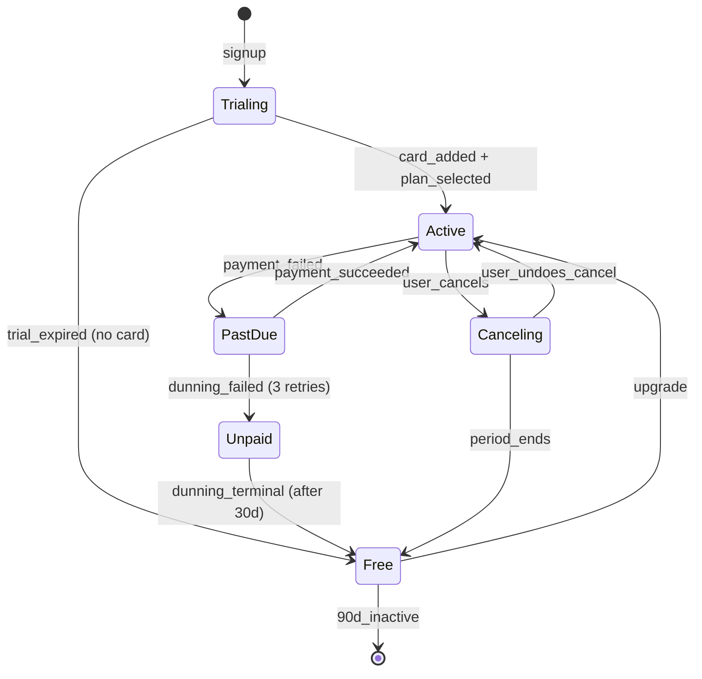
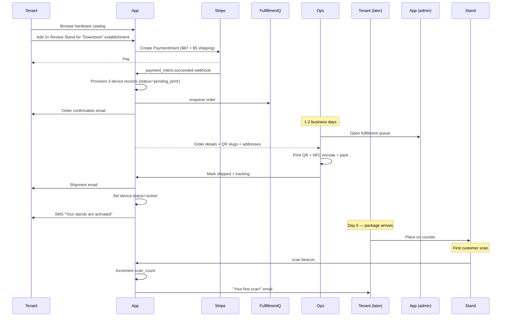
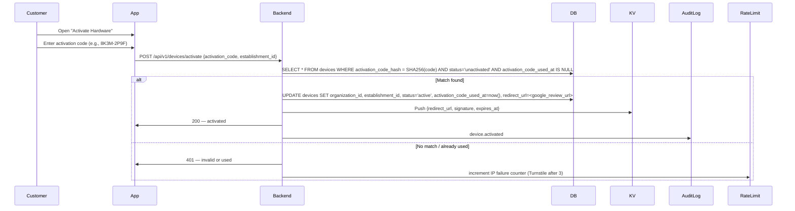

# Billing, Subscription & Hardware Flow — RepuBoost

> How money moves and how the physical Review Stand connects to the software.

---

## 1. Plans & Pricing

### 1.1 Customer-facing tiers

| Plan | Price | What's included |
|---|---|---|
| **Free (Starter)** | $0/forever | 1 establishment, 1 device, basic review sync (Google only), basic dashboard, hardware purchasable a la carte |
| **Pro** | $167/mo (₹13,939) or $1,600/yr (20% off) | Unlimited establishments¹, all AI features, all integrations, all channels, analytics, dispute, priority support |
| **Pro + Phone** | +$49/mo | AI Phone Receptionist add-on (250 min included; $0.25/min over) |
| **Enterprise** | Custom | SAML/SCIM, dedicated CSM, custom contracts, white-label option |

¹ "Unlimited" = soft cap of 25 included; per-establishment overage at $5/mo each.

### 1.2 Trial mechanics
- **7-day free trial of Pro** — no credit card required at signup
- Day 5: in-app banner + email "add card to keep features"
- Day 7: trial expires → revert to Free tier (data preserved, features locked, banner CTA)
- Day 14 post-expiry: hardware-purchase-only mode if not converted
- Day 30 post-expiry: account flagged for review; at 90d, soft-deleted (GDPR-friendly retention)

### 1.3 Hardware (one-time + shipping)

| SKU | Product | Price |
|---|---|---|
| `STAND_V1` | Review Stand (countertop, NFC + QR) | $29 |
| `PLAQUE_V1` | Review Plaque (wall, QR) | $49 |
| `CARD_PACK_50` | Review Cards (pack of 50, business-card size) | $19 |
| `STAND_PRO_5PK` | 5× Review Stands (multi-location bundle) | $129 |

Shipping: $5 US, $15 international (flat). Hardware is purchasable on Free + Pro.

### 1.4 Usage-based add-ons (Pro)
| Item | Included (Pro) | Overage |
|---|---|---|
| AI tokens (review replies, captions, chatbot) | $4 budget | $0.50 per $1 of overage (markup ~25% over our cost) |
| SMS sends | 500/mo | $0.05 each |
| Phone receptionist minutes | 0 (add-on) | $0.25 each (incl 250 in Pro+Phone) |
| Establishments over 25 | 0 | $5/mo each |

---

## 2. Subscription Lifecycle

### 2.1 Stripe configuration
- **Products in Stripe**: `pro_monthly`, `pro_annual`, `addon_phone`, plus one-time hardware SKUs
- **Customer Portal**: tenant manages card, invoices, plan switch, pause
- **Tax**: Stripe Tax enabled (handles US sales tax + EU VAT + India GST)
- **Smart Retries**: enabled for failed payments
- **Coupons**: NEWCUSTOMER25 (25% off first 3 mo), referral codes via affiliate program

### 2.2 Webhooks we handle
| Stripe event | Our action |
|---|---|
| `customer.subscription.created` | Set org plan, log audit |
| `customer.subscription.updated` | Sync status, handle upgrades/downgrades |
| `customer.subscription.deleted` | Downgrade to free at period end |
| `invoice.payment_failed` | Send dunning email, set past_due |
| `invoice.payment_succeeded` | Clear past_due, send receipt |
| `payment_intent.succeeded` (hardware) | Mark order paid, enqueue fulfillment |
| `charge.refunded` | Audit log, notify tenant |

---

## 3. Hardware Flow (the differentiator)

### 3.1 Order → fulfillment → activation

### 3.2 The QR/NFC-to-Google bridge

- Each device gets a unique **10-char Crockford base32 slug** (50 bits entropy, ~10¹⁵ combinations) → e.g., `r.repuboost.io/X7K2P1H4QM`
- Slug → device → establishment → Google Place ID → review write URL
- **Signed redirect**: Edge Worker verifies `slug_signature = HMAC(SECRET, slug || redirect_url || expires_at)` — secret stored in Cloudflare Secrets (NOT KV), so KV poisoning attempts fail signature
- KV is a **cache** of `{redirect_url, signature, expires_at}`; Postgres `devices` table is source of truth (cache miss falls through to Postgres path)
- Edge Worker handles the redirect (sub-50ms anywhere when warm)
- Beacon (`r.repuboost.io/beacon`) emits HMAC-bound `(slug, scan_id, ts, sig)` event to ClickHouse — prevents forged scan inflation
- Per-IP rate limit: 50 req/min on `/r/{slug}` to block enumeration scans
- **Why redirect through us, not direct Google QR?**:
  1. Re-target broken Google URLs without reprinting
  2. A/B test landing experience (e.g., NPS gate before Google for ≤4 ratings)
  3. Track scan-to-review conversion rate per device
  4. Detect abuse (mass scans from same IP)
  5. Tamper-proofing: signed redirect target prevents KV-corruption hijacks

### 3.3 NFC technical details
- NTAG 215 chips (504 bytes — plenty)
- URI record encoded with the same `r.repuboost.io/{slug}`
- Fallback QR printed alongside (older phones, no NFC)
- NFC URI is rewritable in field via app (rare; fix wrong establishment binding) — **requires authentication**:
  1. Authenticated owner/admin session
  2. Physical NFC UID submitted with the rewrite request (proves you're holding the device)
  3. Audit log entry + email notification to org owner ("Your device {serial} was re-bound at {time}")
  4. Per-device rate limit: max 3 rewrites per 30 days

### 3.4 Activation flow (linking QR to software)

**Why two codes** (QR slug + activation code)?

| Identifier | Visible to | Purpose |
|---|---|---|
| `short_slug` (in QR/NFC) | Public — printed on the unit | Runtime redirect identifier; what customers scan |
| `activation_code` | Private — printed on packaging insert only | Ownership proof; one-time use |

Without the activation code, anyone who *finds* a Review Stand could claim it as theirs. Without the QR, the device can't function. Both are required by design.

**Flow:**

**At print/fulfill time:**
1. Admin queue picks up paid hardware order
2. System generates `N` device records: each gets a unique `short_slug` (10 chars) AND a unique `activation_code` (8 chars, 4-4 dashed, e.g., `8K3M-2P9F`)
3. Only the SHA-256 hash of the activation code is stored in DB
4. Print PDF generated: each label page has QR (encoding `r.repuboost.io/{slug}`) + serial + the plaintext activation code (visible)
5. NFC chips encoded with the same URL; chip UID written to `devices.nfc_uid`
6. Pack: card with activation code goes inside the box; QR is on the unit's face
7. Ship; activation code paper exists ONLY in the printed packaging — never re-shown in admin

**What happens when someone scans a non-activated QR:**

| Device state | Edge Worker behavior |
|---|---|
| `unactivated` | 302 → `https://repuboost.io/not-activated?slug=...` (friendly explanation page) |
| `active` (direct mode) | 302 → Google review write URL |
| `active` (smart_route mode) | 302 → `/smart/{slug}` → 1-5⭐ NPS gate → Google for ≥4, private feedback for ≤3 |
| `paused` / `rma` | 302 → fallback page |

### 3.5 Slug + Activation Code format specifics

- **Slug**: 10 chars from Crockford base32 alphabet (`0-9 A-H J-N P-T V-Z` — no `I L O U`) → 32¹⁰ ≈ 1.1 × 10¹⁵ combinations. Generated as `crypto.randomBytes` then base32-encoded; uniqueness enforced by DB UNIQUE constraint with retry on collision (probability negligible).
- **Activation code**: 8 chars from same alphabet, formatted as `XXXX-XXXX` for human entry. Stored as SHA-256 hash. One-time use. Never shown in admin UI after generation.
- **Slug signature**: HMAC-SHA256 of `slug || redirect_url || expires_at`, key in Cloudflare Secrets (rotated quarterly).

### 3.4 Smart-route logic (NPS gate)
Optional per-device behavior (configurable):
1. Customer scans → lands on `r.repuboost.io/{slug}`
2. Edge Worker reads device config:
   - **Direct mode** (default): 302 → Google review URL
   - **Smart mode**: 302 → `/smart/{slug}` → "How was your visit? 1-5?" → if ≥4: Google; if ≤3: feedback form (saved as private survey, no public review)
3. Smart mode = "stop bad reviews before they happen" — major selling point

---

## 4. Admin Operations (hardware)

The admin panel has a dedicated **Fulfillment Queue** view:

| Field | |
|---|---|
| Filter by status | pending_print / printed / shipped / delivered |
| Bulk print labels | Generate PDF with QR + serial + slug |
| Bulk export to ShipStation | CSV with addresses + weights |
| NFC encoding queue | List of slugs to write to chips |
| Inventory tracker | Stock count per SKU per warehouse |
| Damaged returns | Replacement workflow |

### 4.1 Fulfillment options (decision pending)
| Option | Cost / unit | Setup | Trade-off |
|---|---|---|---|
| **In-house (small batches)** | $1 print + $4 chip + $2 labor = $7 | Low | Founder time |
| **3PL (ShipBob/Sticker Mule combo)** | ~$10 | Medium | Hands off, lower margin |
| **Hybrid (3PL holds inventory, we encode NFC)** | ~$8 | Medium | Best balance — recommended for year 1 |

### 4.2 Returns / damaged
- 30-day no-questions return on hardware
- Damaged/defective: free replacement, no return required (cheaper to write off)
- Tracked in admin: `device.status = 'rma'` until resolved

---

## 5. Refund Policy

- **Software (Pro)**: 7-day full refund, no questions; after, prorated to period end
- **Hardware**: 30-day return policy, customer pays return shipping unless defective
- **Trial → no charge** (we don't charge trial)
- All refunds processed via Stripe API from admin panel; audit-logged with reason

---

## 6. Per-Tenant Cost Tracking

The admin panel shows per-tenant unit economics:
| Metric | |
|---|---|
| MRR contribution | from Stripe subscription |
| Hardware revenue lifetime | from `hardware_orders` |
| AI cost MTD | sum of `ai_messages.cost_micros` |
| SMS cost MTD | from Twilio API |
| Email cost MTD | SendGrid (negligible per tenant) |
| Voice cost MTD | Twilio Voice + Anthropic streaming |
| Net contribution margin | MRR − all costs |

Used to:
- Spot unprofitable tenants (rare; usually due to AI abuse)
- Prove unit economics to investors
- Identify upsell candidates (heavy AI users → push them to higher AI budget add-on)

---

## 7. Free Tier Strategy

The free tier exists as a customer acquisition vehicle:
- Hardware → free tier signup → free tier captures real reviews → tenant sees value → upgrades for AI / multi-location

What's intentionally limited:
- 1 establishment only (single-location pain ceiling)
- Only Google reviews sync (no FB / Yelp)
- No AI replies, no automated requests
- No social, no surveys, no inbox
- Ads in dashboard ("Upgrade to Pro to remove this banner")

What's NOT limited (don't be cheap on these):
- Hardware purchase (we make money here too + acquisition)
- Email/SMS notifications when reviews come in
- Reading dashboard

This positioning forces upgrade for any business with > 1 location, or anyone who wants automation — which is the majority.
