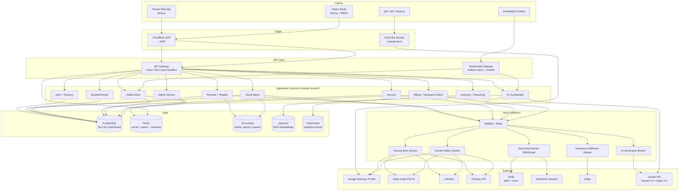
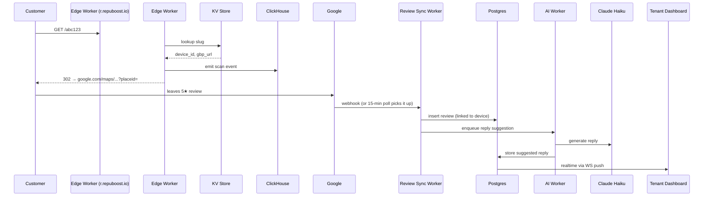
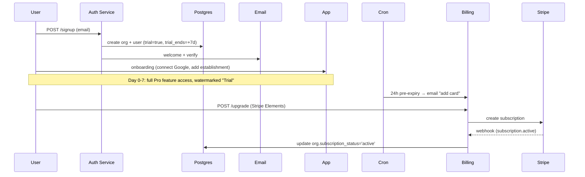
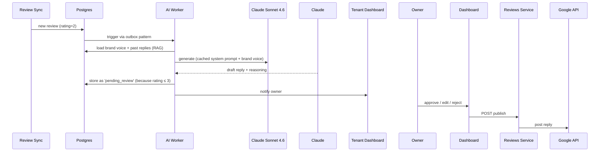

# System Architecture — RepuBoost

> Modular monolith → service-oriented hybrid. Built to be cut into services later when scale forces it, but starts as one deployable to keep the team fast.

---

## 1. High-Level Diagram



---

## 2. Architectural Decisions (ADRs — abbreviated)

### ADR-001: Modular monolith over microservices (at start)

**Context**: 4 P0 modules + 6 P1 modules, small team, fast iteration needed.

**Decision**: Single deployable Next.js app + worker process. Strict module boundaries enforced via folder + ESLint import rules. Each module owns its DB tables and exposes a service-class interface — never reach into another module's tables directly.

**Why not microservices yet**: We don't yet know real boundaries. Premature splitting = distributed monolith pain. We design *for* extraction later (each module has clean interface + own tables).

**When to extract a service**:
- AI Orchestrator → first to extract (scaling + cost isolation)
- Inbox Realtime → second (WebSocket scaling)
- Analytics → third (heavy compute)

**Consequences**:
- ✅ Fast to build, easy to debug, single transaction across modules
- ❌ Limited language diversity (TS only)
- ❌ Single deploy = full app downtime risk → mitigated by zero-downtime deploys

---

### ADR-002: Multi-tenant isolation via PostgreSQL Row-Level Security (RLS)

**Decision**: Single shared schema, every tenant-scoped row has `organization_id`, RLS policies enforce isolation. App sets `SET LOCAL app.current_org_id = ...` per request.

**Alternatives considered**:
- Schema-per-tenant — scales to ~hundreds; we expect 10K+
- Database-per-tenant — operational nightmare at our scale
- Shared schema, app-only filtering — single bug = catastrophic leak (rejected on principle)

**Why RLS**: defense in depth. Even if app forgets a `WHERE org_id = ?`, the DB enforces it.

**Consequences**:
- Audit-friendly, scales to 100K+ tenants
- Adds query overhead (~5-10%) — acceptable
- Migrations harder (must handle policy changes) — manageable with tooling

---

### ADR-003: Next.js App Router as the unified web platform

**Decision**: One Next.js 15 app for tenant dashboard + admin + marketing site. Subdomains:
- `app.repuboost.io` → tenant dashboard
- `admin.repuboost.io` → admin panel (separate auth, IP-allowlisted)
- `repuboost.io` → marketing
- `r.repuboost.io` → short-link redirect (edge function)
- `chat.repuboost.io` → embeddable chatbot

**Why one app**: shared component library, shared types, shared API routes. Subdomain-based middleware routing.

**Why not split admin into separate app**: tempting, but doubles deploy ops, splits the team's mental model. Start unified; extract admin only if security pressures demand it.

---

### ADR-004: Background jobs on BullMQ + Redis (not Inngest / SQS yet)

**Decision**: BullMQ for now, abstracted behind a `JobQueue` interface. Migrate to managed (Inngest, AWS SQS+Step Functions) when self-hosted Redis cost or ops burden exceeds $500/mo savings.

**Why BullMQ**: Cheap, fast, well-known, runs alongside our Redis cache. Good observability (BullBoard).

---

### ADR-005: Claude as the LLM, with model tiering

**Decision**:
- Routine tasks (caption generation, sentiment classification, topic extraction): **Claude Haiku 4.5** (cheap, fast)
- Sensitive tasks (negative review replies, dispute drafts, phone-receptionist conversations): **Claude Sonnet 4.6**
- Heavy reasoning (revenue prediction explanations, audit summaries): **Claude Opus 4.7** (rare)
- Aggressive **prompt caching** on system prompts + per-tenant brand voice docs (>1024 tokens cached per tenant).

**Cost target**: $4/tenant/month average. Caching gets us ~80% reduction on repeated prompts.

See `docs/architecture/AI_STRATEGY.md` (P1) for full prompt architecture.

---

### ADR-006: Short-link service at the edge

**Decision**: `r.repuboost.io/{slug}` runs as a Cloudflare Worker (or Vercel Edge function). Slug → KV lookup → 302 to Google review URL with tracking pixel beacon.

**Why edge**: Sub-50ms anywhere globally, scales free, lets us track scans even if main app is down.

**Tracking**: Each scan beacons `device_id, scan_at, user_agent, geo` to ClickHouse via Tinybird-style ingestion endpoint.

---

## 3. Service Boundaries (modules in the monolith)

```
src/
├── modules/
│   ├── auth/              # SSO, session, password, 2FA
│   ├── tenancy/           # organizations, members, invitations, RBAC
│   ├── establishments/    # multi-location entity
│   ├── connections/       # OAuth tokens for Google/FB/etc
│   ├── reviews/           # review fetching, replies, dispute
│   ├── social/            # post composer, scheduler, monitoring
│   ├── surveys/           # builder, distribution, results
│   ├── inbox/             # unified inbox, channels, threads
│   ├── ai/                # orchestrator: chatbot, replies, captions, RAG
│   ├── phone/             # AI receptionist (P2)
│   ├── billing/           # Stripe, subscriptions, usage metering
│   ├── hardware/          # product catalog, orders, fulfillment, devices
│   ├── analytics/         # event ingest, dashboards, reports
│   └── admin/             # internal panel, impersonation, audit log
├── lib/
│   ├── queue/             # BullMQ wrapper
│   ├── ai/                # Anthropic SDK + caching strategy
│   ├── integrations/      # GBP, Meta, LinkedIn, X, Twilio, SendGrid clients
│   └── db/                # Prisma + RLS helpers
└── app/                   # Next.js routes
    ├── (tenant)/          # tenant dashboard
    ├── (admin)/           # admin panel
    ├── (marketing)/       # public site
    └── api/               # API routes (organized per module)
```

**Inter-module rule**: a module imports another module's *service interface*, never its DB tables.

---

## 4. Critical Flows (sequence diagrams)

### 4.1 Customer scans QR → review captured



### 4.2 Trial signup → paid conversion



### 4.3 AI review reply (sensitive path)



---

### 4.4 KV failure mode (added per CR-4)

`r.repuboost.io/{slug}` lookup hits Cloudflare KV. **KV is a cache, not source of truth.** Postgres `devices` table is canonical. Behavior:

- Cache miss → Edge Worker falls through to a Vercel route that reads Postgres + repopulates KV
- KV outage / corruption → 100% of redirect traffic falls back to Postgres path (degraded latency: 50ms → 200ms, still functional)
- Daily reconciliation worker compares KV ↔ Postgres; alerts on drift
- KV API write tokens are scoped to write-only on one namespace, rotated quarterly, stored in AWS Secrets Manager

If KV API token is compromised, attacker can re-target every QR. Mitigations:
- Edge worker verifies the `slug_signature` (HMAC of `slug || redirect_url || expires_at` with a key in Cloudflare Secrets, NOT in KV)
- Tampered KV entry → signature fails → fall back to Postgres
- Out-of-band monitoring: alert if any device's `redirect_url` changes outside a deploy window or admin-initiated update

## 5. Cross-Cutting Concerns

### 5.1 Authentication & sessions
- Auth.js (NextAuth) with Email magic link + Google + Microsoft + Apple
- Session: HttpOnly cookie, JWT signed, 30-day rolling
- 2FA: TOTP (RFC 6238) — required for Owner role and Admin
- Admin panel: separate cookie domain, IP allowlist, mandatory 2FA

### 5.2 Authorization
- RBAC: roles per organization → `owner | admin | manager | member | viewer`
- Per-establishment override: `establishment_member` table (user × establishment × role)
- Admin panel: separate `admin_user` table, roles `super_admin | support | finance | engineering`
- All authorization via central `can(user, action, resource)` helper

### 5.3 Audit logging
- Every write action emits an `audit_log` row: `actor_id, org_id, action, resource_type, resource_id, before_json, after_json, ip, user_agent, at`
- Admin impersonation = audit_log row + banner in tenant UI ("Admin viewing")
- Retention: 7 years (compliance)

### 5.4 Rate limiting
- Global per-IP: 1000 req/min on edge (Cloudflare)
- Per-org API: 600 req/min default; configurable per plan
- AI generation: per-org budget cap (e.g., $50/day default)
- SMS: per-org cap to prevent runaway billing

### 5.5a Validation, Sanitization & Anti-Abuse Standards

**Input validation** (every API route, every webhook, every queue handler):
- Zod schemas with explicit max-length on every string and max-items on every array
- File uploads: server-side `file-type` content sniff (NEVER trust `Content-Type` header); reject mismatches
- File size cap: 10MB per file, 5 files per request
- URLs: validated by Zod `.url()` + host allowlist for known integrations + SSRF guard module for tenant-supplied URLs (see [AI_STRATEGY.md §6](AI_STRATEGY.md))

**Output encoding / XSS**:
- React's automatic escaping handles 99% of cases
- Any rendered HTML (review bodies, inbox messages, AI-generated content) is server-side sanitized with `sanitize-html` before storage:
  ```ts
  const safeBody = sanitizeHtml(input, {
    allowedTags: ['b', 'i', 'em', 'strong', 'a', 'br', 'p', 'ul', 'ol', 'li'],
    allowedAttributes: { a: ['href', 'rel'] },
    transformTags: { a: sanitizeHtml.simpleTransform('a', { rel: 'nofollow noreferrer noopener', target: '_blank' }) },
  });
  ```
- AI-generated text is rendered as text by default. If a tenant opts into rich-text from AI, it goes through the same sanitizer.

**Account abuse / signup farming**:
- Cloudflare Turnstile on signup, login (after 3 failures), and any public endpoint
- Disposable-email-domain check at signup
- 24-hour cooldown on outbound SMS for new tenants (after that, phone verification required to send first SMS)
- Trial signup IP rate limit: 5 signups per IP per day

**Anti-IDOR**:
- Every mutating route uses `can(user, action, resource)`; cross-establishment access by non-owner returns 404 (not 403)
- Contract test suite asserts cross-tenant access fails for every CRUD endpoint

### 5.5b AI Safety (cross-references AI_STRATEGY.md)

The AI module enforces:
1. Untrusted-content fencing in user turn only (never system)
2. Pre-publish safety classifier on any AI text leaving our system (toxicity / PII leak / off-brand / factual claim / jailbreak)
3. Confidence + citations gate on factual chatbot answers (else lead capture)
4. Per-visitor + per-tenant rate limits on chatbot endpoint
5. Per-tenant daily $ cap (Redis atomic counter) — gracefully degrades on hit
6. SSRF guard on document URL ingestion

See [AI_STRATEGY.md](AI_STRATEGY.md) for full details.

### 5.5 Observability
- **Metrics**: Prometheus → Grafana (or Datadog if budget allows)
- **Tracing**: OpenTelemetry, Honeycomb or Tempo
- **Logging**: Pino (structured JSON) → Loki / CloudWatch
- **Errors**: Sentry
- **Synthetic monitoring**: Checkly hits 12 critical endpoints every 60s
- **AI cost tracking**: every Claude call logs `tenant_id, model, tokens_in, tokens_out, cached, cost_usd` → daily rollup

---

## 6. Failure Modes & Mitigations

| Failure | Impact | Mitigation |
|---|---|---|
| Google API rate-limits us | Reviews stop syncing | Exponential backoff + per-tenant token bucket; alert if > 1h backlog |
| Claude API outage | AI replies / chatbot down | Fallback to "we'll generate this when AI is back" + queue retain; degrade chatbot to canned responses |
| Twilio outage | SMS not sent | Multi-provider abstraction (Twilio primary, MessageBird fallback) for critical SMS |
| Postgres primary down | Total outage | RDS Multi-AZ, < 60s failover; read replicas for analytics |
| Redis outage | Sessions die, queue jams | Redis Sentinel + persistent durable queue mode; degrade to "logged out" state |
| One tenant abuses chatbot | AI cost explosion | Per-tenant daily cap + automatic throttle + ops alert |
| OAuth token revoked | Reviews stop syncing for that tenant | Detect on first 401 → email tenant + UI banner "reconnect" |
| Mass-deletion bug | Data loss | Soft-delete everywhere; daily logical backup; PITR 7 days |

---

## 7. Extraction Roadmap (when to split)

| Module | Extraction trigger | Becomes |
|---|---|---|
| AI Orchestrator | Claude spend > $20K/mo OR queue lag > 5min | Standalone service with own GPU/CPU pool |
| Inbox Realtime | > 5K concurrent WS connections | Dedicated WS server (e.g., Soketi or Centrifugo) |
| Analytics | ClickHouse becomes hot path | Already separate DB; extract API too |
| Hardware Fulfillment | Order volume > 500/mo | Separate ops dashboard for warehouse |
| Short-link | Any cost concern | Already at edge — no extraction needed |
