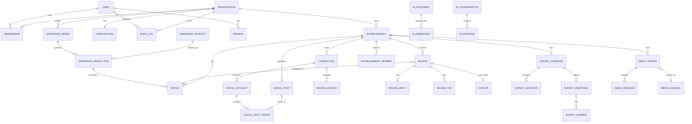

# Data Model — RepuBoost

> PostgreSQL 16 (RDS Aurora). Multi-tenant via Row-Level Security. Soft delete via `deleted_at`. UUID v7 primary keys (time-ordered, index-friendly).

---

## 1. ERD (high-level)



---

## 2. Multi-Tenant Strategy

**Pattern**: Shared schema + RLS, with three Postgres roles (least-privilege per call site).

### 2.1 Database role split

| Role | Privileges | Used by | Network |
|---|---|---|---|
| `app_tenant_user` | NOSUPERUSER, NOBYPASSRLS, can SET `app.current_org_id` | All tenant-facing API + workers | App tier SG |
| `app_admin_reader` | NOSUPERUSER, **BYPASSRLS**, SELECT only | Admin reads, billing aggregation, support impersonation | Admin worker only, IP-allowlisted |
| `app_admin_writer` | NOSUPERUSER, **BYPASSRLS**, INSERT/UPDATE/DELETE on ops-relevant tables | Admin destructive ops only (refunds, suspensions, feature flags) | Admin worker only, requires WebAuthn-validated session in app |
| `audit_writer` | INSERT only on `audit_log` | All services emit audit rows here | App tier |
| `audit_reader` | SELECT only on `audit_log` | Admin reads + compliance exports | Admin worker only |

A trigger on every BYPASSRLS-eligible table fires `RAISE EXCEPTION` if `current_setting('app.audit_context', true)` is NULL — making it impossible to bypass RLS without a paired audit emission.

### 2.2 Canonical RLS policy (mandatory pattern)

Every tenant-scoped table MUST use the both-clauses pattern. `USING` alone allows cross-tenant write escape via `INSERT/UPDATE ... SET organization_id = '<other>'`.

```sql
ALTER TABLE {table} ENABLE ROW LEVEL SECURITY;

CREATE POLICY tenant_isolation ON {table}
  USING       (organization_id = current_setting('app.current_org_id')::uuid)
  WITH CHECK  (organization_id = current_setting('app.current_org_id')::uuid);

-- Force-evaluate for table owner too (PostgreSQL 16+)
ALTER TABLE {table} FORCE ROW LEVEL SECURITY;
```

When `app.current_org_id` is unset, `current_setting(..., true)` returns NULL → cast fails → **0 rows** (deny by default), not all rows.

### 2.3 RLS test invariant (CI gate)

Two CI checks must pass on every PR:

1. **Schema check**: every table with `organization_id` column has an RLS policy with both `USING` and `WITH CHECK` clauses, and `FORCE ROW LEVEL SECURITY` is set.
2. **Cross-tenant attack suite** (`tests/rls/cross_tenant.spec.ts`): for every tenant-scoped table, with two seeded tenants A and B, asserts the following all fail or return 0 rows for A's connection:
   - `SELECT * FROM {table} WHERE organization_id = '{B}'` → 0 rows
   - `INSERT INTO {table} (organization_id, ...) VALUES ('{B}', ...)` → error / 0 affected
   - `UPDATE {table} SET organization_id = '{B}' WHERE id = '{A row}'` → error / 0 affected
   - `DELETE FROM {table} WHERE organization_id = '{B}'` → 0 rows affected
   - With `app.current_org_id` unset: every read returns 0 rows

A failing test is a build-blocker, not a warning.

### 2.4 Audit log integrity

`audit_log` is INSERT-only:
- `audit_writer` Postgres role has only INSERT
- App services connect as `audit_writer` for emission, never `app_admin_writer`
- BEFORE UPDATE/DELETE trigger on `audit_log` raises exception
- Hash-chain columns (`prev_hash`, `row_hash`) bind each row to its predecessor (Merkle-style) — see §3.11
- Daily export to S3 Object Lock bucket (Compliance mode, 7-year retention) for tamper-evident archive

---

## 3. Core Tables

### 3.1 Identity & Tenancy

```sql
-- Top-level tenant
CREATE TABLE organizations (
  id              UUID PRIMARY KEY DEFAULT uuidv7(),
  name            TEXT NOT NULL,
  slug            TEXT UNIQUE NOT NULL,            -- {slug}.repuboost.io optional white-label
  plan            TEXT NOT NULL DEFAULT 'trial',   -- trial | pro | suspended
  trial_ends_at   TIMESTAMPTZ,
  stripe_customer_id TEXT UNIQUE,
  created_at      TIMESTAMPTZ NOT NULL DEFAULT now(),
  updated_at      TIMESTAMPTZ NOT NULL DEFAULT now(),
  deleted_at      TIMESTAMPTZ
);

CREATE TABLE users (
  id              UUID PRIMARY KEY DEFAULT uuidv7(),
  email           CITEXT UNIQUE NOT NULL,
  name            TEXT,
  avatar_url      TEXT,
  password_hash   TEXT,                            -- nullable when SSO-only
  totp_secret     TEXT,                            -- encrypted
  email_verified_at TIMESTAMPTZ,
  last_login_at   TIMESTAMPTZ,
  created_at      TIMESTAMPTZ NOT NULL DEFAULT now()
);

CREATE TABLE memberships (
  id              UUID PRIMARY KEY DEFAULT uuidv7(),
  organization_id UUID NOT NULL REFERENCES organizations(id) ON DELETE CASCADE,
  user_id         UUID NOT NULL REFERENCES users(id) ON DELETE CASCADE,
  role            TEXT NOT NULL,                   -- owner | admin | manager | member | viewer
  created_at      TIMESTAMPTZ NOT NULL DEFAULT now(),
  UNIQUE (organization_id, user_id)
);
ALTER TABLE memberships ENABLE ROW LEVEL SECURITY;

CREATE TABLE invitations (
  id              UUID PRIMARY KEY DEFAULT uuidv7(),
  organization_id UUID NOT NULL REFERENCES organizations(id) ON DELETE CASCADE,
  email           CITEXT NOT NULL,
  role            TEXT NOT NULL,
  token_hash      TEXT NOT NULL,
  expires_at      TIMESTAMPTZ NOT NULL,
  accepted_at     TIMESTAMPTZ,
  created_at      TIMESTAMPTZ NOT NULL DEFAULT now()
);

-- Admin (us) — completely separate identity, NEVER mixed with tenant users
CREATE TABLE admin_users (
  id              UUID PRIMARY KEY DEFAULT uuidv7(),
  email           CITEXT UNIQUE NOT NULL,
  password_hash   TEXT NOT NULL,
  totp_secret     TEXT NOT NULL,                   -- 2FA mandatory
  role            TEXT NOT NULL,                   -- super_admin | support | finance | engineering
  is_active       BOOLEAN NOT NULL DEFAULT TRUE,
  last_ip         INET,
  created_at      TIMESTAMPTZ NOT NULL DEFAULT now()
);
```

### 3.2 Establishments

```sql
CREATE TABLE establishments (
  id              UUID PRIMARY KEY DEFAULT uuidv7(),
  organization_id UUID NOT NULL REFERENCES organizations(id) ON DELETE CASCADE,
  name            TEXT NOT NULL,
  category        TEXT,                            -- restaurant | dental | salon | retail | ...
  address         JSONB,                           -- {line1, city, region, postal, country, lat, lng}
  timezone        TEXT NOT NULL DEFAULT 'UTC',
  brand_voice     JSONB,                           -- {tone, do_not_say, signature, etc}
  business_hours  JSONB,
  google_place_id TEXT,
  created_at      TIMESTAMPTZ NOT NULL DEFAULT now(),
  deleted_at      TIMESTAMPTZ
);
CREATE INDEX idx_estab_org ON establishments(organization_id);
ALTER TABLE establishments ENABLE ROW LEVEL SECURITY;

-- Optional per-establishment access control
CREATE TABLE establishment_members (
  establishment_id UUID NOT NULL REFERENCES establishments(id) ON DELETE CASCADE,
  user_id          UUID NOT NULL REFERENCES users(id) ON DELETE CASCADE,
  role             TEXT NOT NULL,
  PRIMARY KEY (establishment_id, user_id)
);
```

### 3.3 Connections (OAuth)

```sql
-- Envelope encryption: per-row DEK encrypted by per-org CMK.
-- Each token is encrypted with a unique DEK; the DEK is encrypted by KMS with EncryptionContext binding the row to org+provider.
CREATE TABLE connections (
  id              UUID PRIMARY KEY DEFAULT uuidv7(),
  organization_id UUID NOT NULL REFERENCES organizations(id) ON DELETE CASCADE,
  establishment_id UUID REFERENCES establishments(id) ON DELETE CASCADE,
  provider        TEXT NOT NULL,                   -- google_business | meta | linkedin | x | shopify | woocommerce | square | hubspot | salesforce | quickbooks | xero
  account_label   TEXT,                            -- "Acme Pizza FB Page"
  external_id     TEXT,                            -- the provider's account ID
  access_token_ct BYTEA NOT NULL,                  -- AES-GCM ciphertext (token)
  refresh_token_ct BYTEA,                          -- AES-GCM ciphertext
  dek_ciphertext  BYTEA NOT NULL,                  -- KMS-wrapped DEK
  key_version     INTEGER NOT NULL,                -- bump on rotation
  encryption_ctx  JSONB NOT NULL,                  -- {"org_id":"...","provider":"...","purpose":"oauth"}
  iv              BYTEA NOT NULL,                  -- 12-byte AES-GCM nonce
  token_expires_at TIMESTAMPTZ,
  scopes          TEXT[],
  status          TEXT NOT NULL DEFAULT 'active',  -- active | revoked | expired | error
  last_synced_at  TIMESTAMPTZ,
  created_at      TIMESTAMPTZ NOT NULL DEFAULT now()
);
CREATE INDEX idx_conn_org_provider ON connections(organization_id, provider);
CREATE INDEX idx_conn_key_rotation ON connections(key_version) WHERE status = 'active';
ALTER TABLE connections ENABLE ROW LEVEL SECURITY;
ALTER TABLE connections FORCE ROW LEVEL SECURITY;
-- Policy created via 2.2 canonical pattern.

-- Nightly worker re-encrypts any row where key_version < current under the new DEK.
-- KMS key policy enforces: kms:Decrypt allowed only with EncryptionContext matching the row's encryption_ctx,
-- and only by IAM role 'connections-decryptor' (used by review-sync + token-refresh workers).
```

### 3.4 Hardware & Devices

```sql
CREATE TABLE hardware_products (
  id          UUID PRIMARY KEY DEFAULT uuidv7(),
  sku         TEXT UNIQUE NOT NULL,                -- STAND_V1, PLAQUE_V1, CARD_PACK_50
  name        TEXT NOT NULL,
  description TEXT,
  price_cents INTEGER NOT NULL,
  currency    TEXT NOT NULL DEFAULT 'USD',
  has_nfc     BOOLEAN NOT NULL DEFAULT FALSE,
  image_url   TEXT,
  is_active   BOOLEAN NOT NULL DEFAULT TRUE
);

CREATE TABLE hardware_orders (
  id              UUID PRIMARY KEY DEFAULT uuidv7(),
  organization_id UUID NOT NULL REFERENCES organizations(id),
  status          TEXT NOT NULL DEFAULT 'pending', -- pending | paid | printing | shipped | delivered | cancelled
  shipping_address JSONB NOT NULL,
  total_cents     INTEGER NOT NULL,
  stripe_payment_intent TEXT,
  carrier         TEXT,
  tracking_number TEXT,
  shipped_at      TIMESTAMPTZ,
  delivered_at    TIMESTAMPTZ,
  created_at      TIMESTAMPTZ NOT NULL DEFAULT now()
);
ALTER TABLE hardware_orders ENABLE ROW LEVEL SECURITY;

CREATE TABLE hardware_order_items (
  id              UUID PRIMARY KEY DEFAULT uuidv7(),
  order_id        UUID NOT NULL REFERENCES hardware_orders(id) ON DELETE CASCADE,
  product_id      UUID NOT NULL REFERENCES hardware_products(id),
  establishment_id UUID REFERENCES establishments(id),
  quantity        INTEGER NOT NULL,
  unit_price_cents INTEGER NOT NULL
);

-- Each physical thing in the field.
-- Two separate identifiers:
--   short_slug       -> what the QR / NFC URI encodes (public, runtime)
--   activation_code  -> what the customer enters in-app to claim ownership (private, packaging-only, one-time use)
CREATE TABLE devices (
  id                   UUID PRIMARY KEY DEFAULT uuidv7(),
  organization_id      UUID REFERENCES organizations(id),         -- nullable until activated
  establishment_id     UUID REFERENCES establishments(id),         -- nullable until activated
  product_sku          TEXT NOT NULL,
  serial               TEXT UNIQUE NOT NULL,                       -- printed on the unit
  short_slug           TEXT UNIQUE NOT NULL,                       -- 10-char Crockford base32 (50 bits) → r.repuboost.io/{slug}
  slug_signature       TEXT NOT NULL,                              -- HMAC(secret, slug || redirect_url || expires_at) — verified at edge
  nfc_uid              TEXT UNIQUE,
  activation_code_hash TEXT NOT NULL,                              -- SHA-256 of one-time activation code (printed on packaging)
  activation_code_used_at TIMESTAMPTZ,
  redirect_url         TEXT,                                       -- nullable until activated; written by tenant
  redirect_mode        TEXT NOT NULL DEFAULT 'direct',             -- direct | smart_route (NPS gate)
  redirect_changed_at  TIMESTAMPTZ,                                -- alerts ops if changed outside deploy window
  status               TEXT NOT NULL DEFAULT 'unactivated',        -- unactivated | active | paused | rma | retired
  scan_count           INTEGER NOT NULL DEFAULT 0,
  last_scan_at         TIMESTAMPTZ,
  activated_at         TIMESTAMPTZ,
  created_at           TIMESTAMPTZ NOT NULL DEFAULT now()
);
CREATE INDEX idx_dev_estab ON devices(establishment_id) WHERE establishment_id IS NOT NULL;
CREATE INDEX idx_dev_slug ON devices(short_slug);
CREATE INDEX idx_dev_status ON devices(status, organization_id);
ALTER TABLE devices ENABLE ROW LEVEL SECURITY;
ALTER TABLE devices FORCE ROW LEVEL SECURITY;
-- RLS policy allows organization_id IS NULL row reads only by admin role (so activation lookup doesn't leak across tenants).
-- Cloudflare KV stores a *cache* of (slug → {redirect_url, signature, expires_at}); Postgres is source of truth.
```

### 3.5 Reviews

```sql
CREATE TABLE reviews (
  id              UUID PRIMARY KEY DEFAULT uuidv7(),
  organization_id UUID NOT NULL REFERENCES organizations(id),
  establishment_id UUID NOT NULL REFERENCES establishments(id),
  source          TEXT NOT NULL,                   -- google | facebook | yelp | trustpilot | internal
  external_id     TEXT NOT NULL,                   -- Google review ID
  reviewer_name   TEXT,
  rating          INTEGER NOT NULL CHECK (rating BETWEEN 1 AND 5),
  body            TEXT,
  language        TEXT,
  posted_at       TIMESTAMPTZ NOT NULL,
  attributed_device_id UUID REFERENCES devices(id), -- if scan→review attribution
  attributed_request_id UUID,                       -- if SMS/email request driven
  sentiment       NUMERIC(3,2),                    -- -1.00 to +1.00
  topics          TEXT[],
  raw             JSONB,
  fetched_at      TIMESTAMPTZ NOT NULL DEFAULT now(),
  UNIQUE (source, external_id)
);
CREATE INDEX idx_rev_estab_posted ON reviews(establishment_id, posted_at DESC);
CREATE INDEX idx_rev_org_rating ON reviews(organization_id, rating);
ALTER TABLE reviews ENABLE ROW LEVEL SECURITY;

CREATE TABLE review_replies (
  id              UUID PRIMARY KEY DEFAULT uuidv7(),
  review_id       UUID UNIQUE NOT NULL REFERENCES reviews(id) ON DELETE CASCADE,
  organization_id UUID NOT NULL REFERENCES organizations(id),
  body            TEXT NOT NULL,
  status          TEXT NOT NULL DEFAULT 'draft',   -- draft | pending_approval | published | failed
  generated_by    TEXT,                            -- haiku-4-5 | sonnet-4-6 | human
  approved_by     UUID REFERENCES users(id),
  published_at    TIMESTAMPTZ,
  created_at      TIMESTAMPTZ NOT NULL DEFAULT now()
);

CREATE TABLE review_disputes (
  id              UUID PRIMARY KEY DEFAULT uuidv7(),
  review_id       UUID UNIQUE NOT NULL REFERENCES reviews(id) ON DELETE CASCADE,
  organization_id UUID NOT NULL REFERENCES organizations(id),
  reason          TEXT NOT NULL,                   -- spam | fake | offensive | conflict | other
  evidence        TEXT,
  status          TEXT NOT NULL DEFAULT 'submitted', -- submitted | under_review | upheld | rejected
  submitted_at    TIMESTAMPTZ NOT NULL DEFAULT now(),
  resolved_at     TIMESTAMPTZ
);

-- Outbound review requests (SMS / email)
CREATE TABLE review_requests (
  id              UUID PRIMARY KEY DEFAULT uuidv7(),
  organization_id UUID NOT NULL REFERENCES organizations(id),
  establishment_id UUID NOT NULL REFERENCES establishments(id),
  channel         TEXT NOT NULL,                   -- sms | email
  recipient       TEXT NOT NULL,                   -- phone or email
  template_id     UUID,
  short_slug      TEXT NOT NULL,                   -- so we can attribute the resulting review
  scheduled_for   TIMESTAMPTZ NOT NULL,
  sent_at         TIMESTAMPTZ,
  delivered_at    TIMESTAMPTZ,
  opened_at       TIMESTAMPTZ,
  clicked_at      TIMESTAMPTZ,
  converted_at    TIMESTAMPTZ,                     -- left a review
  status          TEXT NOT NULL DEFAULT 'queued',  -- queued | sent | delivered | failed | unsubscribed
  trigger_source  TEXT,                            -- shopify_order | manual | survey_followup | ...
  created_at      TIMESTAMPTZ NOT NULL DEFAULT now()
);
ALTER TABLE review_requests ENABLE ROW LEVEL SECURITY;
```

### 3.6 Social media

```sql
CREATE TABLE social_accounts (
  id              UUID PRIMARY KEY DEFAULT uuidv7(),
  organization_id UUID NOT NULL REFERENCES organizations(id),
  establishment_id UUID NOT NULL REFERENCES establishments(id),
  connection_id   UUID NOT NULL REFERENCES connections(id) ON DELETE CASCADE,
  platform        TEXT NOT NULL,                   -- facebook_page | instagram_business | gbp | linkedin_page | x
  external_id     TEXT NOT NULL,
  display_name    TEXT,
  avatar_url      TEXT,
  is_active       BOOLEAN NOT NULL DEFAULT TRUE,
  UNIQUE (platform, external_id)
);
ALTER TABLE social_accounts ENABLE ROW LEVEL SECURITY;

CREATE TABLE social_posts (
  id              UUID PRIMARY KEY DEFAULT uuidv7(),
  organization_id UUID NOT NULL REFERENCES organizations(id),
  establishment_id UUID NOT NULL REFERENCES establishments(id),
  author_user_id  UUID REFERENCES users(id),
  body            TEXT NOT NULL,
  media           JSONB,                           -- [{type, url, alt}]
  scheduled_for   TIMESTAMPTZ,
  status          TEXT NOT NULL DEFAULT 'draft',   -- draft | scheduled | publishing | published | failed
  ai_generated    BOOLEAN NOT NULL DEFAULT FALSE,
  created_at      TIMESTAMPTZ NOT NULL DEFAULT now()
);
ALTER TABLE social_posts ENABLE ROW LEVEL SECURITY;

CREATE TABLE social_post_targets (
  id              UUID PRIMARY KEY DEFAULT uuidv7(),
  post_id         UUID NOT NULL REFERENCES social_posts(id) ON DELETE CASCADE,
  social_account_id UUID NOT NULL REFERENCES social_accounts(id),
  status          TEXT NOT NULL DEFAULT 'pending', -- pending | published | failed
  external_post_id TEXT,
  permalink       TEXT,
  error           TEXT,
  published_at    TIMESTAMPTZ
);
```

### 3.7 Surveys

```sql
CREATE TABLE survey_campaigns (
  id              UUID PRIMARY KEY DEFAULT uuidv7(),
  organization_id UUID NOT NULL REFERENCES organizations(id),
  establishment_id UUID REFERENCES establishments(id), -- nullable = org-wide
  name            TEXT NOT NULL,
  type            TEXT NOT NULL,                   -- nps | csat | custom
  channel         TEXT NOT NULL,                   -- email | sms | both
  incentive       JSONB,                           -- {type: 'discount', value: 10, code: 'WELCOME10'}
  trigger_event   TEXT,                            -- post_purchase | post_visit | manual
  delay_minutes   INTEGER NOT NULL DEFAULT 0,
  status          TEXT NOT NULL DEFAULT 'draft',
  created_at      TIMESTAMPTZ NOT NULL DEFAULT now()
);
ALTER TABLE survey_campaigns ENABLE ROW LEVEL SECURITY;

CREATE TABLE survey_questions (
  id              UUID PRIMARY KEY DEFAULT uuidv7(),
  campaign_id     UUID NOT NULL REFERENCES survey_campaigns(id) ON DELETE CASCADE,
  position        INTEGER NOT NULL,
  type            TEXT NOT NULL,                   -- rating | nps | text | multichoice | yes_no
  prompt          TEXT NOT NULL,
  options         JSONB,
  branching       JSONB                            -- skip-logic
);

CREATE TABLE survey_responses (
  id              UUID PRIMARY KEY DEFAULT uuidv7(),
  campaign_id     UUID NOT NULL REFERENCES survey_campaigns(id) ON DELETE CASCADE,
  organization_id UUID NOT NULL REFERENCES organizations(id),
  recipient       TEXT,
  rating_summary  NUMERIC(3,2),                    -- average across rating questions
  smart_route_to  TEXT,                            -- review_request | support_ticket | none
  completed_at    TIMESTAMPTZ,
  created_at      TIMESTAMPTZ NOT NULL DEFAULT now()
);

CREATE TABLE survey_answers (
  response_id     UUID NOT NULL REFERENCES survey_responses(id) ON DELETE CASCADE,
  question_id     UUID NOT NULL REFERENCES survey_questions(id),
  value           JSONB,
  PRIMARY KEY (response_id, question_id)
);
```

### 3.8 Unified Inbox

```sql
CREATE TABLE inbox_threads (
  id              UUID PRIMARY KEY DEFAULT uuidv7(),
  organization_id UUID NOT NULL REFERENCES organizations(id),
  establishment_id UUID REFERENCES establishments(id),
  channel         TEXT NOT NULL,                   -- email | facebook_msg | instagram_dm | gbp_qa | webchat | sms
  external_thread_id TEXT,
  subject         TEXT,
  participant     JSONB,                           -- {name, handle, avatar}
  status          TEXT NOT NULL DEFAULT 'open',    -- open | snoozed | closed | spam
  assignee_id     UUID REFERENCES users(id),
  last_message_at TIMESTAMPTZ NOT NULL DEFAULT now(),
  unread_count    INTEGER NOT NULL DEFAULT 0,
  created_at      TIMESTAMPTZ NOT NULL DEFAULT now()
);
CREATE INDEX idx_inbox_org_status ON inbox_threads(organization_id, status, last_message_at DESC);
ALTER TABLE inbox_threads ENABLE ROW LEVEL SECURITY;

CREATE TABLE inbox_messages (
  id              UUID PRIMARY KEY DEFAULT uuidv7(),
  thread_id       UUID NOT NULL REFERENCES inbox_threads(id) ON DELETE CASCADE,
  organization_id UUID NOT NULL REFERENCES organizations(id),
  direction       TEXT NOT NULL,                   -- inbound | outbound
  author_user_id  UUID REFERENCES users(id),       -- when outbound by team
  body            TEXT NOT NULL,
  attachments     JSONB,
  ai_suggested    TEXT,                            -- if AI proposed a reply
  external_id     TEXT,
  sent_at         TIMESTAMPTZ NOT NULL DEFAULT now()
);

CREATE TABLE inbox_internal_notes (
  id              UUID PRIMARY KEY DEFAULT uuidv7(),
  thread_id       UUID NOT NULL REFERENCES inbox_threads(id) ON DELETE CASCADE,
  author_user_id  UUID NOT NULL REFERENCES users(id),
  body            TEXT NOT NULL,
  created_at      TIMESTAMPTZ NOT NULL DEFAULT now()
);
```

### 3.9 AI

```sql
-- Knowledge docs uploaded for chatbot RAG
CREATE TABLE ai_documents (
  id              UUID PRIMARY KEY DEFAULT uuidv7(),
  organization_id UUID NOT NULL REFERENCES organizations(id),
  establishment_id UUID REFERENCES establishments(id),
  title           TEXT NOT NULL,
  source_type     TEXT NOT NULL,                   -- manual | url | pdf | gbp_listing
  source_uri      TEXT,
  content         TEXT NOT NULL,
  status          TEXT NOT NULL DEFAULT 'indexed', -- indexing | indexed | failed
  created_at      TIMESTAMPTZ NOT NULL DEFAULT now()
);
ALTER TABLE ai_documents ENABLE ROW LEVEL SECURITY;

CREATE TABLE ai_embeddings (
  id              UUID PRIMARY KEY DEFAULT uuidv7(),
  document_id     UUID NOT NULL REFERENCES ai_documents(id) ON DELETE CASCADE,
  organization_id UUID NOT NULL REFERENCES organizations(id),
  establishment_id UUID REFERENCES establishments(id),  -- isolation per location for multi-location tenants
  chunk_text      TEXT NOT NULL,
  embedding       VECTOR(1024),                         -- pgvector, voyage-3 dim
  content_hash    TEXT NOT NULL,                        -- SHA-256 for delta re-embed
  position        INTEGER NOT NULL,
  metadata        JSONB                                 -- {section, page_no, source_uri}
);
-- HNSW per (org, establishment) — retrieval ALWAYS filters by both
CREATE INDEX idx_ai_emb_hnsw ON ai_embeddings USING hnsw (embedding vector_cosine_ops);
CREATE INDEX idx_ai_emb_org_est ON ai_embeddings (organization_id, establishment_id);
ALTER TABLE ai_embeddings ENABLE ROW LEVEL SECURITY;
ALTER TABLE ai_embeddings FORCE ROW LEVEL SECURITY;

-- Chatbot conversations
CREATE TABLE ai_conversations (
  id              UUID PRIMARY KEY DEFAULT uuidv7(),
  organization_id UUID NOT NULL REFERENCES organizations(id),
  establishment_id UUID REFERENCES establishments(id),
  visitor_id      TEXT NOT NULL,                   -- anonymous browser ID
  channel         TEXT NOT NULL,                   -- webchat | phone
  lead_email      TEXT,
  lead_phone      TEXT,
  handed_off_at   TIMESTAMPTZ,                     -- if escalated to human
  created_at      TIMESTAMPTZ NOT NULL DEFAULT now()
);

CREATE TABLE ai_messages (
  id              UUID PRIMARY KEY DEFAULT uuidv7(),
  conversation_id UUID REFERENCES ai_conversations(id) ON DELETE CASCADE,
  organization_id UUID NOT NULL REFERENCES organizations(id),
  purpose         TEXT NOT NULL,                   -- review_reply_sensitive | review_reply_thank | caption | chatbot | phone | sentiment | safety_classifier
  prompt_version_id UUID REFERENCES prompt_versions(id),
  retrieved_chunk_ids UUID[],                      -- for RAG explainability + audit
  role            TEXT NOT NULL,                   -- user | assistant | system
  content         TEXT NOT NULL,
  model           TEXT,                            -- haiku-4-5 | sonnet-4-6 | opus-4-7
  tokens_in       INTEGER,
  tokens_out      INTEGER,
  cache_read_tokens INTEGER,
  cache_creation_tokens INTEGER,
  cost_micros     INTEGER,                         -- in millionths of USD
  latency_ms      INTEGER,                         -- end-to-end including streaming
  created_at      TIMESTAMPTZ NOT NULL DEFAULT now()
);
CREATE INDEX idx_ai_msg_conv ON ai_messages(conversation_id, created_at);
CREATE INDEX idx_ai_msg_purpose_org ON ai_messages(organization_id, purpose, created_at DESC);
ALTER TABLE ai_messages ENABLE ROW LEVEL SECURITY;
ALTER TABLE ai_messages FORCE ROW LEVEL SECURITY;

-- ML lifecycle support tables
CREATE TABLE prompt_versions (
  id              UUID PRIMARY KEY DEFAULT uuidv7(),
  purpose         TEXT NOT NULL,                   -- same enum as ai_messages.purpose
  version         INTEGER NOT NULL,
  template        TEXT NOT NULL,                   -- with {{slots}}
  model           TEXT NOT NULL,
  params          JSONB NOT NULL,                  -- {temperature, max_tokens, top_p, ...}
  cache_breakpoints JSONB,                         -- which segments get cache_control + ttl
  active          BOOLEAN NOT NULL DEFAULT FALSE,
  rollout_pct     INTEGER NOT NULL DEFAULT 0,      -- 0-100 for A/B
  created_by      UUID REFERENCES users(id),
  created_at      TIMESTAMPTZ NOT NULL DEFAULT now(),
  UNIQUE (purpose, version)
);

CREATE TABLE ai_evals (
  id              UUID PRIMARY KEY DEFAULT uuidv7(),
  prompt_version_id UUID NOT NULL REFERENCES prompt_versions(id),
  golden_set_id   TEXT NOT NULL,
  metric          TEXT NOT NULL,                   -- safety | brand_voice | factuality | latency_p95 | helpfulness
  score           NUMERIC(5,4) NOT NULL,
  judge_model     TEXT,
  sample_count    INTEGER,
  ran_at          TIMESTAMPTZ NOT NULL DEFAULT now()
);
CREATE INDEX idx_ai_evals_prompt ON ai_evals(prompt_version_id, metric);

CREATE TABLE ai_feedback (
  id              UUID PRIMARY KEY DEFAULT uuidv7(),
  organization_id UUID NOT NULL REFERENCES organizations(id),
  message_id      UUID REFERENCES ai_messages(id),
  reply_id        UUID REFERENCES review_replies(id),
  rating          SMALLINT NOT NULL,               -- -1 | 0 | +1
  edit_distance   INTEGER,                         -- char distance between AI draft and final published
  reason          TEXT,
  user_id         UUID REFERENCES users(id),
  created_at      TIMESTAMPTZ NOT NULL DEFAULT now()
);
ALTER TABLE ai_feedback ENABLE ROW LEVEL SECURITY;
ALTER TABLE ai_feedback FORCE ROW LEVEL SECURITY;

CREATE TABLE ai_safety_verdicts (
  message_id      UUID PRIMARY KEY REFERENCES ai_messages(id),
  toxic           BOOLEAN NOT NULL DEFAULT FALSE,
  pii_leak        BOOLEAN NOT NULL DEFAULT FALSE,
  off_brand       BOOLEAN NOT NULL DEFAULT FALSE,
  factual_claim   BOOLEAN NOT NULL DEFAULT FALSE,
  jailbreak_attempt BOOLEAN NOT NULL DEFAULT FALSE,
  exfil_url       BOOLEAN NOT NULL DEFAULT FALSE,
  system_prompt_leak BOOLEAN NOT NULL DEFAULT FALSE,
  medical_claim   BOOLEAN NOT NULL DEFAULT FALSE,
  legal_claim     BOOLEAN NOT NULL DEFAULT FALSE,
  financial_claim BOOLEAN NOT NULL DEFAULT FALSE,
  reviewer_name_quoted BOOLEAN NOT NULL DEFAULT FALSE,
  classifier_model TEXT,
  raw_json        JSONB,
  decided_at      TIMESTAMPTZ NOT NULL DEFAULT now(),
  blocked         BOOLEAN NOT NULL DEFAULT FALSE
);
-- Any verdict with a true flag → reply.status = 'pending_review' (human approval required)

-- AI forensics: extra columns on ai_messages for dispute / explanation reconstruction
ALTER TABLE ai_messages
  ADD COLUMN rendered_prompt_hash TEXT,           -- SHA-256 of full materialized request
  ADD COLUMN rendered_prompt_s3_key TEXT,         -- encrypted full body in S3 (7yr retention)
  ADD COLUMN anthropic_message_id TEXT,           -- vendor-side ID
  ADD COLUMN model_fingerprint   TEXT,            -- response.system_fingerprint
  ADD COLUMN system_prompt_hash  TEXT,            -- which system block was used
  ADD COLUMN cache_state         JSONB,           -- {bp1_hit, bp2_hit, ttl}
  ADD COLUMN redacted_content    TEXT,            -- PII-scrubbed for analytics/eval reuse
  ADD COLUMN pii_spans           JSONB,           -- offsets+types from Presidio
  ADD COLUMN legal_hold          BOOLEAN NOT NULL DEFAULT FALSE;

-- AI documents: forensic + isolation tightening
ALTER TABLE ai_documents
  ADD COLUMN content_hash       TEXT,
  ADD COLUMN last_indexed_at    TIMESTAMPTZ,
  ALTER COLUMN status TYPE TEXT;                  -- now: indexing | indexed | quarantined | failed
ALTER TABLE ai_documents FORCE ROW LEVEL SECURITY;

-- AI conversations: enforce RLS with FORCE
ALTER TABLE ai_conversations ENABLE ROW LEVEL SECURITY;
ALTER TABLE ai_conversations FORCE ROW LEVEL SECURITY;
ALTER TABLE ai_conversations
  ADD COLUMN consent_recorded_at TIMESTAMPTZ,     -- phone receptionist consent
  ADD COLUMN parent_conversation_id UUID,         -- on jailbreak detection, fork to new conversation
  ADD COLUMN terminated_reason  TEXT;             -- normal | cost_cap | jailbreak | error

-- AI disputes: track tenant or end-user complaints about AI output
CREATE TABLE ai_disputes (
  id              UUID PRIMARY KEY DEFAULT uuidv7(),
  organization_id UUID NOT NULL REFERENCES organizations(id),
  message_id      UUID NOT NULL REFERENCES ai_messages(id),
  filed_by        TEXT NOT NULL,                  -- tenant | end_user_email | regulator
  filer_contact   TEXT,
  category        TEXT NOT NULL,                  -- defamation | factual | gdpr_explanation | safety | other
  description     TEXT,
  evidence_pack_s3 TEXT,                          -- generated dossier (prompt+response+chunks+verdicts)
  status          TEXT NOT NULL DEFAULT 'open',   -- open | investigating | resolved | escalated
  resolved_at     TIMESTAMPTZ,
  created_at      TIMESTAMPTZ NOT NULL DEFAULT now()
);
ALTER TABLE ai_disputes ENABLE ROW LEVEL SECURITY;
ALTER TABLE ai_disputes FORCE ROW LEVEL SECURITY;

-- On dispute filing, mark associated ai_messages with legal_hold=true → retention purge skips
CREATE OR REPLACE FUNCTION ai_dispute_legal_hold() RETURNS trigger AS $$
BEGIN
  UPDATE ai_messages SET legal_hold = TRUE WHERE id = NEW.message_id;
  RETURN NEW;
END;
$$ LANGUAGE plpgsql;
CREATE TRIGGER trg_ai_dispute_legal_hold AFTER INSERT ON ai_disputes
  FOR EACH ROW EXECUTE FUNCTION ai_dispute_legal_hold();
```

### 3.10 Billing

```sql
CREATE TABLE subscriptions (
  id              UUID PRIMARY KEY DEFAULT uuidv7(),
  organization_id UUID UNIQUE NOT NULL REFERENCES organizations(id),
  stripe_subscription_id TEXT UNIQUE,
  plan            TEXT NOT NULL,                   -- pro_monthly | pro_annual
  status          TEXT NOT NULL,                   -- trialing | active | past_due | canceled | unpaid
  current_period_end TIMESTAMPTZ,
  cancel_at_period_end BOOLEAN NOT NULL DEFAULT FALSE,
  trial_ends_at   TIMESTAMPTZ,
  created_at      TIMESTAMPTZ NOT NULL DEFAULT now()
);

CREATE TABLE usage_meters (
  id              UUID PRIMARY KEY DEFAULT uuidv7(),
  organization_id UUID NOT NULL REFERENCES organizations(id),
  meter           TEXT NOT NULL,                   -- ai_tokens | sms_count | establishments | phone_minutes
  period_start    DATE NOT NULL,
  period_end      DATE NOT NULL,
  quantity        BIGINT NOT NULL DEFAULT 0,
  UNIQUE (organization_id, meter, period_start)
);

CREATE TABLE invoices (
  id              UUID PRIMARY KEY DEFAULT uuidv7(),
  organization_id UUID NOT NULL REFERENCES organizations(id),
  stripe_invoice_id TEXT UNIQUE,
  amount_cents    INTEGER NOT NULL,
  currency        TEXT NOT NULL DEFAULT 'USD',
  status          TEXT NOT NULL,                   -- paid | open | void | uncollectible
  pdf_url         TEXT,
  issued_at       TIMESTAMPTZ NOT NULL DEFAULT now(),
  paid_at         TIMESTAMPTZ
);
```

### 3.11 Audit & Admin

```sql
CREATE TABLE audit_log (
  id              UUID PRIMARY KEY DEFAULT uuidv7(),
  organization_id UUID,                            -- nullable when admin acting outside a tenant
  actor_type      TEXT NOT NULL,                   -- user | admin_user | system
  actor_id        UUID NOT NULL,
  action          TEXT NOT NULL,                   -- e.g., 'review.reply.publish'
  resource_type   TEXT,
  resource_id     UUID,
  before_data     JSONB,
  after_data      JSONB,
  ip              INET,
  user_agent      TEXT,
  -- Hash chain for tamper-evidence: row_hash = SHA256(prev_hash || canonical_json(this_row))
  prev_hash       BYTEA,
  row_hash        BYTEA NOT NULL,
  created_at      TIMESTAMPTZ NOT NULL DEFAULT now()
);
CREATE INDEX idx_audit_org_time ON audit_log(organization_id, created_at DESC);
CREATE INDEX idx_audit_actor ON audit_log(actor_id, created_at DESC);

-- Block UPDATE / DELETE — append-only.
CREATE OR REPLACE FUNCTION audit_log_immutable() RETURNS trigger AS $$
BEGIN
  RAISE EXCEPTION 'audit_log is append-only (attempted % by %)', TG_OP, current_user;
END;
$$ LANGUAGE plpgsql;

CREATE TRIGGER trg_audit_log_immutable
BEFORE UPDATE OR DELETE ON audit_log
FOR EACH ROW EXECUTE FUNCTION audit_log_immutable();

-- Daily worker exports last 24h of audit_log to s3://audit-archive/{date}/ in S3 Object Lock (compliance mode, 7y).
-- Hash-chain verification job runs nightly: walk row_hash → prev_hash backwards, alert on mismatch.

CREATE TABLE feature_flags (
  organization_id UUID NOT NULL REFERENCES organizations(id) ON DELETE CASCADE,
  flag            TEXT NOT NULL,
  enabled         BOOLEAN NOT NULL,
  set_by_admin_id UUID REFERENCES admin_users(id),
  set_at          TIMESTAMPTZ NOT NULL DEFAULT now(),
  PRIMARY KEY (organization_id, flag)
);

-- Admin impersonation sessions (read-only by default)
CREATE TABLE admin_impersonations (
  id              UUID PRIMARY KEY DEFAULT uuidv7(),
  admin_user_id   UUID NOT NULL REFERENCES admin_users(id),
  organization_id UUID NOT NULL REFERENCES organizations(id),
  reason          TEXT NOT NULL,                   -- mandatory free text
  read_only       BOOLEAN NOT NULL DEFAULT TRUE,
  started_at      TIMESTAMPTZ NOT NULL DEFAULT now(),
  ended_at        TIMESTAMPTZ
);
```

---

### 3.12 Consent, Suppression, Webhook & OAuth State

```sql
-- TCPA: prior express written consent per phone number
CREATE TABLE sms_consents (
  id                 UUID PRIMARY KEY DEFAULT uuidv7(),
  organization_id    UUID NOT NULL REFERENCES organizations(id),
  phone_e164         TEXT NOT NULL,
  consent_text_hash  TEXT NOT NULL,                -- SHA-256 of the disclosure shown
  consent_source     TEXT NOT NULL,                -- web_form | qr_intake | imported_with_attestation
  consent_ip         INET,
  consent_ua         TEXT,
  consented_at       TIMESTAMPTZ NOT NULL,
  revoked_at         TIMESTAMPTZ,
  UNIQUE (organization_id, phone_e164)
);
ALTER TABLE sms_consents ENABLE ROW LEVEL SECURITY;
ALTER TABLE sms_consents FORCE ROW LEVEL SECURITY;

-- CAN-SPAM + STOP / unsubscribe one-click
CREATE TABLE unsubscribes (
  channel            TEXT NOT NULL,                -- email | sms
  email_or_phone     TEXT NOT NULL,
  organization_id    UUID,                         -- NULL = global suppression (across all orgs we run)
  unsubscribed_at    TIMESTAMPTZ NOT NULL DEFAULT now(),
  source             TEXT,                         -- one_click_email | sms_stop | manual
  PRIMARY KEY (channel, email_or_phone, organization_id)
);
-- Workers MUST check unsubscribes + sms_consents before sending; violation logs an audit row.

-- Webhook idempotency + replay protection
CREATE TABLE webhook_deliveries (
  provider           TEXT NOT NULL,                -- stripe | twilio | meta | google | linkedin | shopify | sendgrid
  external_id        TEXT NOT NULL,                -- e.g., Stripe event.id, Shopify webhook id
  received_at        TIMESTAMPTZ NOT NULL DEFAULT now(),
  payload_sha256     TEXT NOT NULL,
  status             TEXT NOT NULL,                -- accepted | rejected_signature | replay | error
  processed_at       TIMESTAMPTZ,
  error              TEXT,
  PRIMARY KEY (provider, external_id)
);
-- Every inbound webhook handler executes:
--   INSERT INTO webhook_deliveries (...) ON CONFLICT (provider, external_id) DO NOTHING RETURNING *;
--   if 0 rows -> replay -> 200 OK + drop (idempotent for the sender)

-- OAuth state CSRF protection (single-use nonce table)
CREATE TABLE oauth_state_consumed (
  nonce              TEXT PRIMARY KEY,
  organization_id    UUID NOT NULL,
  user_id            UUID NOT NULL,
  provider           TEXT NOT NULL,
  consumed_at        TIMESTAMPTZ NOT NULL DEFAULT now()
);
-- TTL cleanup: delete rows older than 1 hour daily.

-- Public survey response tokens — single-use, expiring
CREATE TABLE survey_response_tokens (
  token_hash         TEXT PRIMARY KEY,             -- SHA-256 of the URL token
  campaign_id        UUID NOT NULL REFERENCES survey_campaigns(id) ON DELETE CASCADE,
  organization_id    UUID NOT NULL REFERENCES organizations(id),
  recipient          TEXT NOT NULL,                -- phone or email — for binding
  expires_at         TIMESTAMPTZ NOT NULL,
  consumed_at        TIMESTAMPTZ,
  created_at         TIMESTAMPTZ NOT NULL DEFAULT now()
);

-- Embeddable widget short-lived JWT registration (per tenant)
CREATE TABLE widget_keys (
  id                 UUID PRIMARY KEY DEFAULT uuidv7(),
  organization_id    UUID NOT NULL REFERENCES organizations(id) ON DELETE CASCADE,
  public_key         TEXT NOT NULL,                -- safe to embed in <script src="...?key=PK">
  hmac_secret_ct     BYTEA NOT NULL,               -- envelope-encrypted secret used to sign per-visitor JWTs
  origin_allowlist   TEXT[],                       -- e.g., ['https://customer.com']
  rate_limit_per_visitor JSONB NOT NULL,           -- {window_sec: 300, max_msgs: 20}
  status             TEXT NOT NULL DEFAULT 'active',
  created_at         TIMESTAMPTZ NOT NULL DEFAULT now()
);
ALTER TABLE widget_keys ENABLE ROW LEVEL SECURITY;
ALTER TABLE widget_keys FORCE ROW LEVEL SECURITY;
```

---

## 4. Analytics (ClickHouse)

Hot, append-only events for fast aggregation. Mirrors-only — never source of truth.

```sql
-- ClickHouse
CREATE TABLE events (
  event_at        DateTime64(3),
  org_id          UUID,
  establishment_id UUID,
  user_id         Nullable(UUID),
  event_type      LowCardinality(String),  -- 'qr_scan', 'review_received', 'social_post_published', ...
  device_id       Nullable(UUID),
  source          LowCardinality(String),
  meta            String                    -- JSON
)
ENGINE = MergeTree()
PARTITION BY toYYYYMM(event_at)
ORDER BY (org_id, event_type, event_at)
TTL event_at + INTERVAL 25 MONTH;
```

Materialized views drive dashboards:
- `mv_review_velocity_daily` (org_id, est_id, day, count, avg_rating)
- `mv_qr_scan_to_review_funnel`
- `mv_social_engagement_daily`

---

## 5. Indexing Strategy (top hits)

| Table | Index | Reason |
|---|---|---|
| `reviews` | `(establishment_id, posted_at DESC)` | Dashboard list |
| `reviews` | `(organization_id, rating)` | Star distribution |
| `review_requests` | `(scheduled_for) WHERE status='queued'` | Worker pickup |
| `inbox_threads` | `(organization_id, status, last_message_at DESC)` | Inbox view |
| `audit_log` | `(organization_id, created_at DESC)` | Admin tenant timeline |
| `devices` | `(short_slug)` UNIQUE | Edge redirect lookup |
| `ai_embeddings` | HNSW on `embedding` | RAG search |

---

## 6. Production-Readiness Additions

> Added 2026-05-09 from a 3rd-pass DB efficiency review. These are the differences between "schema works" and "schema scales to 10K tenants without paging us at 2am."

### 6.1 RLS GUC subselect optimization

`current_setting('app.current_org_id')::uuid` evaluates **per row** in the original policy. PG can't use index-only scans because the function is `STABLE`, not `IMMUTABLE`. Use a wrapped function + subselect form (Supabase pattern) so PG evaluates the GUC ONCE per query:

```sql
CREATE OR REPLACE FUNCTION app.current_org() RETURNS uuid
  LANGUAGE sql STABLE PARALLEL SAFE AS
  $$ SELECT current_setting('app.current_org_id', true)::uuid $$;

-- Replace EVERY policy with subselect form:
DROP POLICY tenant_isolation ON {table};
CREATE POLICY tenant_isolation ON {table}
  USING       (organization_id = (SELECT app.current_org()))
  WITH CHECK  (organization_id = (SELECT app.current_org()));
```

Performance impact: ~5-30x fewer GUC evaluations on large scans.

### 6.2 Tenant-leading composite indexes (replace existing)

RLS policy filters on `organization_id` first; composite indexes must be `(organization_id, ...)` to be RLS-friendly and enable index-only scans. Re-create:

```sql
-- Reviews
CREATE INDEX CONCURRENTLY idx_rev_org_estab_posted
  ON reviews (organization_id, establishment_id, posted_at DESC)
  INCLUDE (rating, reviewer_name, source, sentiment);
CREATE INDEX CONCURRENTLY idx_rev_org_rating_posted
  ON reviews (organization_id, rating, posted_at DESC);

-- Review requests (worker pickup is the hot query)
CREATE INDEX CONCURRENTLY idx_rr_due
  ON review_requests (organization_id, scheduled_for)
  WHERE status = 'queued';
CREATE INDEX CONCURRENTLY idx_rr_org_estab
  ON review_requests (organization_id, establishment_id, created_at DESC);

-- Inbox listing (covering index avoids heap fetch)
CREATE INDEX CONCURRENTLY idx_inbox_list
  ON inbox_threads (organization_id, status, last_message_at DESC)
  INCLUDE (subject, channel, assignee_id, unread_count, establishment_id);
CREATE INDEX CONCURRENTLY idx_inbox_assignee
  ON inbox_threads (organization_id, assignee_id, status) WHERE status = 'open';
CREATE INDEX CONCURRENTLY idx_msgs_thread
  ON inbox_messages (thread_id, sent_at DESC);

-- AI
CREATE INDEX CONCURRENTLY idx_ai_msg_org_purpose
  ON ai_messages (organization_id, purpose, created_at DESC);
CREATE INDEX CONCURRENTLY idx_ai_msg_org_conv
  ON ai_messages (organization_id, conversation_id, created_at);
CREATE INDEX CONCURRENTLY idx_ai_emb_org_est_doc
  ON ai_embeddings (organization_id, establishment_id, document_id);
CREATE INDEX CONCURRENTLY idx_ai_msg_chunks
  ON ai_messages USING gin (retrieved_chunk_ids);

-- Audit
CREATE INDEX CONCURRENTLY idx_audit_org_time
  ON audit_log (organization_id, created_at DESC)
  INCLUDE (action, actor_id, resource_type);
CREATE INDEX CONCURRENTLY idx_audit_resource
  ON audit_log (resource_type, resource_id, created_at DESC);
CREATE INDEX CONCURRENTLY idx_audit_row_hash
  ON audit_log (row_hash);

-- Devices
CREATE INDEX CONCURRENTLY idx_dev_org_status
  ON devices (organization_id, status);
CREATE INDEX CONCURRENTLY idx_dev_unactivated
  ON devices (activation_code_hash) WHERE status = 'unactivated';

-- Connections
CREATE INDEX CONCURRENTLY idx_conn_org_provider_status
  ON connections (organization_id, provider, status);
CREATE INDEX CONCURRENTLY idx_conn_key_rotation
  ON connections (key_version) WHERE status = 'active';

-- Suppression lookup (high-cardinality first)
CREATE INDEX CONCURRENTLY idx_unsub_lookup
  ON unsubscribes (email_or_phone, channel, organization_id);

-- Webhook + OAuth state cleanup
CREATE INDEX CONCURRENTLY idx_wd_received ON webhook_deliveries (received_at);
CREATE INDEX CONCURRENTLY idx_oauth_consumed_at ON oauth_state_consumed (consumed_at);
CREATE INDEX CONCURRENTLY idx_srt_expires ON survey_response_tokens (expires_at);

-- Billing
CREATE INDEX CONCURRENTLY idx_um_org_period ON usage_meters (organization_id, period_start DESC);
CREATE INDEX CONCURRENTLY idx_invoice_org ON invoices (organization_id, issued_at DESC);
CREATE INDEX CONCURRENTLY idx_ho_org_status ON hardware_orders (organization_id, status, created_at DESC);
```

### 6.3 HNSW retune for multi-tenant retrieval

Default pgvector params `m=16, ef_construction=64` underperform when the index is searched with a tenant pre-filter (RLS + `WHERE organization_id =`). Bump and enable iterative scan (PG16 + pgvector 0.7+):

```sql
DROP INDEX idx_ai_emb_hnsw;
CREATE INDEX idx_ai_emb_hnsw ON ai_embeddings
  USING hnsw (embedding vector_cosine_ops)
  WITH (m = 32, ef_construction = 200);

-- Per-session settings the retrieval helper applies:
SET hnsw.iterative_scan = 'strict_order';
SET hnsw.ef_search = 100;
```

For tenants with >100K chunks, partition the embeddings table by `organization_id` hash (8 partitions) — revisit only when needed.

### 6.4 Partitioning (pg_partman)

High-churn or retention-bound tables MUST be partitioned. Single-heap tables become VACUUM disasters at 50M+ rows; retention DELETE locks the table.

```sql
CREATE EXTENSION IF NOT EXISTS pg_partman;

-- Re-create as partitioned tables (do this in Phase 0 — easier than later migration)
-- Then:
SELECT partman.create_parent('public.audit_log',          'created_at',   'native', 'monthly', p_premake := 4, p_retention := '7 years');
SELECT partman.create_parent('public.ai_messages',        'created_at',   'native', 'monthly', p_premake := 2, p_retention := '90 days');
SELECT partman.create_parent('public.inbox_messages',     'sent_at',      'native', 'monthly', p_premake := 2, p_retention := '25 months');
SELECT partman.create_parent('public.review_requests',    'created_at',   'native', 'monthly', p_premake := 2, p_retention := '13 months');
SELECT partman.create_parent('public.webhook_deliveries', 'received_at',  'native', 'weekly',  p_premake := 2, p_retention := '90 days');
```

Note: partitioned tables require the partition key in the PRIMARY KEY (`PRIMARY KEY (id, created_at)` for `audit_log`).

`reviews` does NOT need partitioning yet (indefinite retention, no DELETE pressure) — revisit at 50M rows.

### 6.5 Soft-delete + chunked hard-delete (no cascade storms)

`ON DELETE CASCADE` from `organizations` flows through ~30 tables. A single delete locks all of them in one transaction at multi-million-row scale → 60+ minute lock holding statement_timeout.

```sql
-- Replace cascades with RESTRICT on org-level FKs
ALTER TABLE establishments DROP CONSTRAINT establishments_organization_id_fkey,
  ADD CONSTRAINT establishments_organization_id_fkey
    FOREIGN KEY (organization_id) REFERENCES organizations(id) ON DELETE RESTRICT;
-- (repeat for connections, reviews, devices, subscriptions, etc.)

-- Add deleted_at (soft delete state) to organizations
ALTER TABLE organizations ADD COLUMN deleted_at TIMESTAMPTZ;

-- Async hard-delete worker: 30 days after deleted_at, processes 1000 rows/loop with sleep
-- (avoids long lock; allows undo within 30d for GDPR + accidents)
```

### 6.6 DOMAINs + CHECKs (replace TEXT + comment)

```sql
-- Strict-typed strings
CREATE DOMAIN phone_e164    AS TEXT CHECK (VALUE ~ '^\+[1-9][0-9]{1,14}$');
CREATE DOMAIN currency_code AS TEXT CHECK (VALUE ~ '^[A-Z]{3}$');
CREATE DOMAIN crockford_slug AS TEXT CHECK (VALUE ~ '^[0-9A-HJKMNP-TV-Z]{10}$');

-- Apply where used
ALTER TABLE sms_consents ALTER COLUMN phone_e164 TYPE phone_e164;
ALTER TABLE invoices     ALTER COLUMN currency   TYPE currency_code;
ALTER TABLE devices      ALTER COLUMN short_slug TYPE crockford_slug;

-- Enum CHECK constraints (ALTERable; native ENUM is rigid)
ALTER TABLE review_requests ADD CONSTRAINT review_requests_status_chk
  CHECK (status IN ('queued','sent','delivered','failed','unsubscribed'));
ALTER TABLE devices ADD CONSTRAINT devices_status_chk
  CHECK (status IN ('unactivated','active','paused','rma','retired'));
ALTER TABLE devices ADD CONSTRAINT devices_redirect_when_active
  CHECK (status = 'unactivated' OR redirect_url IS NOT NULL);
ALTER TABLE reviews ADD CONSTRAINT reviews_sentiment_range
  CHECK (sentiment BETWEEN -1 AND 1);
-- Repeat for: organizations.plan, connections.status/provider, reviews.source,
-- review_replies.status, inbox_threads.status/channel, social_posts.status,
-- subscriptions.status, invoices.status, hardware_orders.status.
```

### 6.7 Cross-tenant collision fix on `reviews`

`UNIQUE (source, external_id)` on `reviews` rejects the second tenant's INSERT when two tenants are connected to the same Google Place (chain agencies). Scope to establishment:

```sql
ALTER TABLE reviews DROP CONSTRAINT reviews_source_external_id_key;
ALTER TABLE reviews ADD CONSTRAINT reviews_source_external_estab_uniq
  UNIQUE (establishment_id, source, external_id);
```

### 6.8 Encrypted phone with HMAC index (TCPA suppression check)

`review_requests.recipient` will be envelope-encrypted (PII). But the suppression check `WHERE recipient = ?` against ciphertext is impossible. Dual-column pattern:

```sql
ALTER TABLE review_requests
  ADD COLUMN recipient_hmac BYTEA,           -- HMAC-SHA256 with per-org pepper
  ADD COLUMN recipient_ct   BYTEA;           -- AES-GCM ciphertext blob

CREATE INDEX idx_rr_recipient_hmac
  ON review_requests (organization_id, recipient_hmac);

-- App computes HMAC for lookups; raw value never queried in cleartext.
-- Same pattern for sms_consents.phone_e164 if PII encryption applies.
```

### 6.9 Materialized views for aggregates

Dashboard hits like "avg rating per establishment" must NOT recompute against `reviews` on every page load. Hourly refresh:

```sql
CREATE MATERIALIZED VIEW mv_establishment_stats AS
SELECT
  organization_id,
  establishment_id,
  COUNT(*)                            AS review_count,
  AVG(rating)::numeric(3,2)           AS avg_rating,
  COUNT(*) FILTER (WHERE rating <= 3) AS negative_count,
  MAX(posted_at)                      AS last_review_at
FROM reviews
GROUP BY organization_id, establishment_id;

CREATE UNIQUE INDEX ON mv_establishment_stats (organization_id, establishment_id);

SELECT cron.schedule('refresh-estab-stats', '5 * * * *',
  'REFRESH MATERIALIZED VIEW CONCURRENTLY mv_establishment_stats');
```

For `devices.scan_count`, write to ClickHouse on every scan beacon (already designed); refresh a `mv_device_stats` hourly for the dashboard.

### 6.10 Connection pooling (RDS Proxy)

Aurora Serverless v2 + Vercel/Fly serverless = connection storm risk. Aurora max conns ≈ 3000 at 16 ACUs; Vercel functions can spawn that during a spike.

Topology:
```
Vercel functions  ─┐
Fly.io workers    ─┼─→ RDS Proxy (max 6000)  ─→ Aurora writer
                   │
Admin worker      ─┘─→ RDS Proxy reader endpoint  ─→ Aurora reader replica
```

Prisma connection string: `?pgbouncer=true&connection_limit=1`. RDS Proxy idle timeout = 1800s. IAM-auth on the Proxy. Enables thousands of short-lived serverless functions without thrashing connections.

### 6.11 Per-role timeouts (fail fast, prevent runaway)

```sql
ALTER ROLE app_tenant_user SET statement_timeout                     = '15s';
ALTER ROLE app_tenant_user SET idle_in_transaction_session_timeout    = '30s';
ALTER ROLE app_tenant_user SET lock_timeout                           = '5s';
ALTER ROLE app_admin_reader SET statement_timeout                    = '60s';
ALTER ROLE app_admin_writer SET statement_timeout                    = '30s';
ALTER ROLE audit_writer    SET statement_timeout                      = '5s';
```

### 6.12 Aurora parameter group (production)

```
shared_buffers              = 25% of RAM
effective_cache_size        = 75% of RAM
work_mem                    = 16MB
maintenance_work_mem        = 2GB
random_page_cost            = 1.1
effective_io_concurrency    = 200
default_statistics_target   = 200
autovacuum_naptime          = 30s
autovacuum_vacuum_scale_factor   = 0.05
autovacuum_analyze_scale_factor  = 0.02
log_min_duration_statement  = 500ms
log_lock_waits              = on
deadlock_timeout            = 1s
hnsw.ef_search              = 100
shared_preload_libraries    = 'pg_stat_statements,pg_partman_bgw,pg_cron'
pg_stat_statements.track    = all
track_io_timing             = on
```

Per-table autovacuum overrides for high-churn tables:
```sql
ALTER TABLE audit_log        SET (autovacuum_vacuum_scale_factor = 0.01, autovacuum_analyze_scale_factor = 0.005);
ALTER TABLE ai_messages      SET (autovacuum_vacuum_scale_factor = 0.02);
ALTER TABLE review_requests  SET (autovacuum_vacuum_scale_factor = 0.02, fillfactor = 90);
ALTER TABLE inbox_threads    SET (fillfactor = 80);    -- frequent UPDATE on last_message_at
ALTER TABLE devices          SET (fillfactor = 80);    -- scan_count UPDATEs
```

### 6.13 Squawk migration rules (CI gate)

Pin `squawk` config in `.squawk.toml`:
```toml
excluded_rules = []   # No exclusions; all rules enabled
[lints]
adding-required-field            = "deny"
disallowed-unique-constraint     = "deny"
renaming-column                  = "deny"
removing-column                  = "deny"
changing-column-type             = "deny"
prefer-text-field                = "warn"
ban-drop-table                   = "deny"
ban-drop-column                  = "deny"
require-concurrent-index-creation = "deny"
```
Migrations bypass with PR title marker `_PHASE3` only after DBA review.

### 6.14 Pagination contract (cursor only)

Every list endpoint returns `{data, next_cursor}` where `next_cursor` is `base64(uuidv7)`. NO offset pagination on `/reviews`, `/inbox/threads`, `/audit`, `/ai/conversations`, `/audit_log` — deep offsets (`LIMIT 50 OFFSET 100000`) make the planner do a full scan of 100K skipped rows.

```sql
-- Cursor pattern (UUIDv7 is time-sortable so cursor = last id):
SELECT * FROM reviews
WHERE organization_id = $1
  AND id > $2::uuid          -- the cursor
ORDER BY id DESC
LIMIT 51;                    -- 51 to detect "has more"
```

### 6.15 Inbox last-message denormalization (avoid N+1)

Inbox listing needs the last message body per thread. Materialize on `inbox_threads`:

```sql
ALTER TABLE inbox_threads
  ADD COLUMN last_message_body      TEXT,
  ADD COLUMN last_message_direction TEXT,
  ADD COLUMN last_message_author_id UUID;

-- Trigger maintains it on inbox_messages INSERT
CREATE OR REPLACE FUNCTION inbox_thread_touch() RETURNS trigger AS $$
BEGIN
  UPDATE inbox_threads SET
    last_message_at = NEW.sent_at,
    last_message_body = LEFT(NEW.body, 200),
    last_message_direction = NEW.direction,
    last_message_author_id = NEW.author_user_id,
    unread_count = CASE WHEN NEW.direction = 'inbound' THEN unread_count + 1 ELSE unread_count END
  WHERE id = NEW.thread_id;
  RETURN NEW;
END;
$$ LANGUAGE plpgsql;
CREATE TRIGGER trg_inbox_thread_touch AFTER INSERT ON inbox_messages
  FOR EACH ROW EXECUTE FUNCTION inbox_thread_touch();
```

---

## 7. Migration & Backup

- **Tool**: Prisma Migrate (TS-first ergonomics)
- **PR check**: every migration must include RLS policy if new tenant-scoped table
- **Backups**: PITR 7 days on RDS, daily logical dump archived to S3 30d, monthly 1y
- **Cross-region replica**: read-only in eu-west-1 for DR + EU residency option
